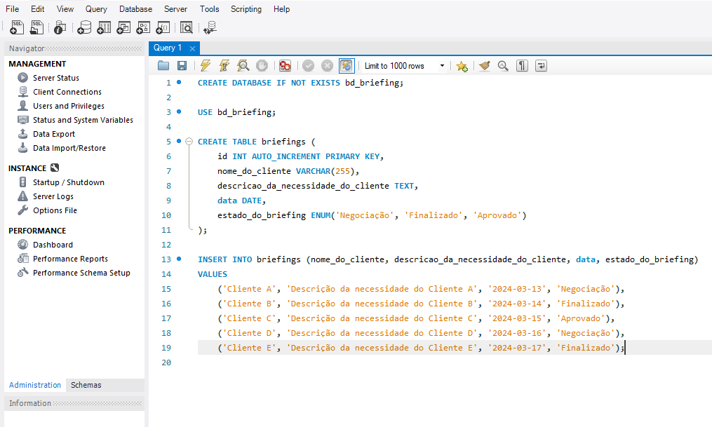

# Tutorial de Instalação

Este é um tutorial passo a passo para instalar os requisitos necessários para esta API.

## Passo 1: Instalar o GIT

GIT é um sistema de controle de versão amplamente utilizado para o gerenciamento de código-fonte.

### Windows

1. Baixe o [instalador do GIT para Windows](https://git-scm.com/download/win).
2. Execute o arquivo baixado e siga as instruções do instalador.
3. Após a instalação, verifique se o GIT foi instalado corretamente abrindo o prompt de comando e digitando o seguinte comando:

```bash
git --version
```

### macOS

1. GIT geralmente já vem pré-instalado no macOS. Se não estiver, você pode instalá-lo usando o Homebrew ou baixando o [instalador do GIT para macOS](https://git-scm.com/download/mac) do site oficial.
2. Siga as instruções do instalador para concluir a instalação.
3. Após a instalação, verifique se o GIT foi instalado corretamente abrindo o Terminal e digitando o seguinte comando:

```bash
git --version
```

### Linux (Debian/Ubuntu)

1. Abra o Terminal e execute:

```bash
sudo apt-get update
```
```bash
sudo apt-get install git
```

2. Após a instalação, verifique se o GIT foi instalado corretamente digitando o seguinte comando:

```bash
git --version
```

## Passo 2: Instalar o Node.js

Node.js é uma plataforma que permite que você execute JavaScript no servidor.

### Windows

1. Baixe o [instalador do Node.js para Windows](https://nodejs.org/en/download/).
2. Execute o arquivo baixado e siga as instruções do instalador.
3. Após a instalação, verifique se o Node.js foi instalado corretamente abrindo o prompt de comando e digitando os seguintes comandos:

```bash
node -v
```
```bash
npm -v
```

### macOS

1. Baixe o [instalador do Node.js para macOS](https://nodejs.org/en/download/).
2. Execute o arquivo baixado e siga as instruções do instalador.
3. Após a instalação, verifique se o Node.js foi instalado corretamente abrindo o Terminal e digitando os seguintes comandos:

```bash
node -v
```
```bash
npm -v
```

### Linux (Debian/Ubuntu)

1. Abra o Terminal e execute:

```bash
curl -fsSL https://deb.nodesource.com/setup_lts.x | sudo -E bash -
```
```bash
sudo apt-get install -y nodejs
```

2. Após a instalação, verifique se o Node.js foi instalado corretamente digitando os seguintes comandos:

```bash
node -v
```
```bash
npm -v
```

## Passo 3: Instalar o MySQL

MySQL é um sistema de gerenciamento de banco de dados relacional amplamente utilizado.

### Windows

1. Baixe o [instalador do MySQL para Windows](https://dev.mysql.com/downloads/windows/installer/8.0.html).
2. Selecione a primeira opção pois não vamos utilizar todos os recursos do MYSQL. 


3. Após selecionar a opção de download. Você será levado para uma tela onde será perguntado se você quer fazer login antes continuar, mas não há necessidade. Clique em "No thanks, just start my download."

4. Após o download. Clique no arquivo de instalação e você será levado a essa tela. Clique em custom


6. Após clicar em "custom". Você será levado para essa tela. Nela iremos selecionar apenas as ferramentas que utilizaremos para executar o projeto. Sendo assim, Siga o passo a passo:


```bash
   1. Clicar em MySQL Server.
   2. MySQL Server 8.0.
   3. Selecione a primeira opção.
   4. Clicar na seta verde
```
```bash
   1. Clicar em Applications.
   2. Mysql Workbench.
   3. Mysql Workbench 8.0.
   4. Selecione a primeira opcao.
   5. Clicar na seta verde
```
7. Feito o passo a passo. Sua tela ficará assim. Basta clicar em next.


8. Após esse passo é só clicar em next até chegar na imagem do passo 9.


9. Nesta parte não precisamos fazer nada. Apenas verificar se a porta alocada para o banco é a 3306. Pode clicar em next.


10. Essa parte é de extrema importância. Clique na segunda opção "Use Legacy Authentication" para não termos problemas de autenticação mais a frente.


11. Aqui iremos selecionar uma senha para acessar o banco. Digite a senha **root** pois será a que irá ser utilizada pelo código para acessar o banco.


12. Nesta parte, se você não quiser que o Mysql inicie toda vez que você ligar o computador, desmarque a opção "Start the MySQL at System Startup". Após isso, basta clicar em next até finalizar a instalação.


## Passo 4: Inicializando o MySQL Workbench

1. Após a instalação do MySQL Workbench. Você irá se deparar com a seguinte tela. Clique na conexao root e entre com sua senha root. Caso seu workbench não esteja dessa forma, basta criar uma nova conexão no passo 2. Caso não, podemos pular para o passo 3.


2. Caso você não tenha uma conexão, ou esteja com problemas de se conectar. Crie uma nova conexão clicando no botão de **+** ao lado de **MySQL Connections**. Você verá essa tela a seguir. Escolha um nome para a conexão e sertifique-se que o **username** está como **root**, assim como a senha para acessar a conexão, pois o código utiliza-rá isso para se conectar com o banco.


3. Ao se conectar. Você será levado para essa tela.


## Passo 5: Povoando o Banco de Dados

1. Para essa API funcionar corretamente ela precisa de um banco de dados local com regras de negócio específicas. Sendo assim, inicie uma nova query clicando no botão superior SQL (Logo abaixo do botão "File", clique no botão com um papel escrito SQL) e cole os seguintes comandos:



```bash
CREATE DATABASE IF NOT EXISTS bd_briefing;

USE bd_briefing;

CREATE TABLE briefings (
    id INT AUTO_INCREMENT PRIMARY KEY,
    nome_do_cliente VARCHAR(255),
    descricao_da_necessidade_do_cliente TEXT,
    data DATE,
    estado_do_briefing ENUM('Negociação', 'Finalizado', 'Aprovado')
);

INSERT INTO briefings (nome_do_cliente, descricao_da_necessidade_do_cliente, data, estado_do_briefing)
VALUES
    ('Cliente A', 'Descrição da necessidade do Cliente A', '2024-03-13', 'Negociação'),
    ('Cliente B', 'Descrição da necessidade do Cliente B', '2024-03-14', 'Finalizado'),
    ('Cliente C', 'Descrição da necessidade do Cliente C', '2024-03-15', 'Aprovado'),
    ('Cliente D', 'Descrição da necessidade do Cliente D', '2024-03-16', 'Negociação'),
    ('Cliente E', 'Descrição da necessidade do Cliente E', '2024-03-17', 'Finalizado');
```

2. Em seguida, clique no raio amarelo nas opções acima do editor. Após isso, nosso banco está pronto.

## Passo 6: Rodando a aplicação

1. Para rodar a aplicação é simples. Digite no seu terminal o seguinte comando:

```bash
git clone https://github.com/filipelimavaz/projeto-ayty-briefing.git
```

2. Entre na pasta do projeto. Entre na pasta API. Abra o terminal dentro dessa pasta e digite o comando:
   1. Para instalar as dependências da aplicação:
      ```bash
      npm install
      ```
   2. Para executar os testes:
      ```bash
      npm test
      ```
   3. Para iniciar a aplicação:
      ```bash
      npm run dev
      ```
      
   **APÓS ESSES PASSOS DEIXE O TERMINAL ABERTO**
      
3. A API está executando, mas apenas o backend. Sendo assim, vamos inicializar o frontend.
4. Entre na pasta frontend do projeto, abra outro terminal e execute os seguintes passos:
   1. Para instalar as dependências da aplicação:
      ```bash
      npm install
      ```
   2. Para executar os testes:
      ```bash
      npm run test:watch
      ```
   3. Para iniciar a aplicação:
      ```bash
      npm start
      ```
      
   **APÓS ESSES PASSOS DEIXE O TERMINAL ABERTO**

5. Feito esses passos. Sua aplicação estará pronta para ser executada.
